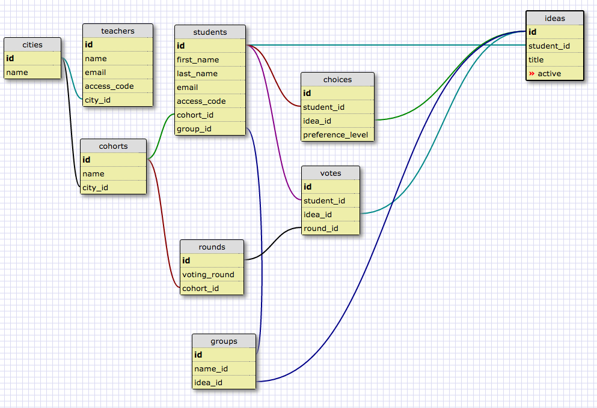

# 3CT
Client Project - Dev Bootcamp Final Project Voting App

##Project Name
CCCT

##Names and github handle for people on the team

- [Christopher Mendoza](https://github.com/wushuchris)
- [Conor Burke](https://github.com/conorburke)
- [Chelsey Lin](https://github.com/chelseylin)
- [Tae Jun Yun](https://github.com/yuntsj)

##Description of project

CCCT is a voting application designed for Dev Bootcamp final projects but can be adapted for any organization.  The main idea of the application is to allow for a group of users to submit ideas that can then be voted on for inclusion in a final round of preferences. There are three primary phases of the app:

1. Idea Generation
2. Favorites Voting 
3. Preference Voting

###Model Schema

##How to install the code locally

CCCT can be cloned or downloaded and run locally and is hosted on Heroku at [CCCT](https://evening-earth-59833.herokuapp.com/ideas/new)

##How to use the app

An administrator(i.e. teacher) is able to create a list of users and give them access to the site.  The administrator is then able to open and close the phases of the site.  The first phase allows users to submit ideas that they would like to work on as a part of a group project. 

Once the idea generation phase is closed, the administrator opens the first favorites voting round, which allows users to vote on a set number of projects they are interested in.  When the current round is closed, unpopular ideas are eliminated.  CCCT calculates vote totals per voting round for each idea. Based on the desired number of final selection ideas that the administrator selects, CCCT narrows down the selection each round until the desired number of options is obtained. 

During the final round when users submit their preferences for which project they would want to work on, CCCT prioritizes their selections to make a best-fit match for all users.  The administrator can adjust this outcome before selection announcements are made.

##License

